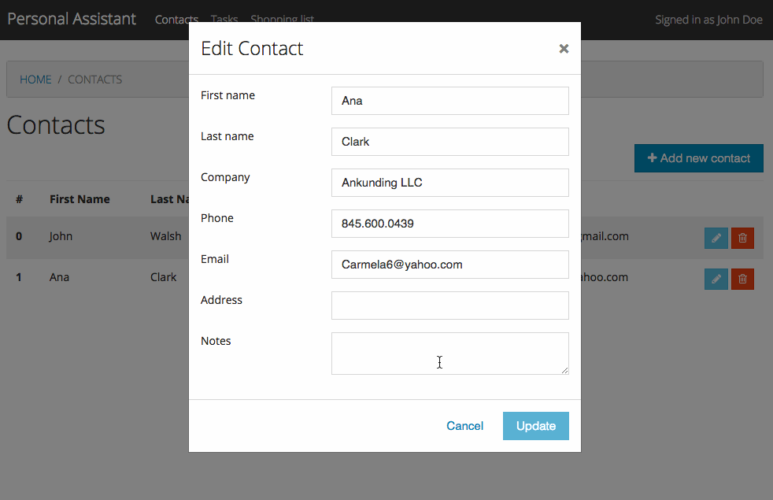

# Personal Assistant UI - Angular 4+

This is a simple pet project application that shows how to implement Angular 4+ apps with unit tests, e2e tests against 
a stub backend, configuration for deployment in Heroku, etc.

It uses Bootstrap 4 css framework, and components from [ng-bootstrap](https://ng-bootstrap.github.io)
and [ngx-toastr](https://github.com/scttcper/ngx-toastr) projects.

Some of the things that demo the app are:
 - having multiple feature modules (different pages) with router navigation.
 - example of a CRUD view with a table and modals with forms to add, edit, delete items.

This project was generated with [Angular CLI](https://github.com/angular/angular-cli) version 1.0.0.

## Development server

Run `ng serve` for a dev server. Navigate to `http://localhost:4200/`. The app will automatically reload if you change any of the source files.

## Code scaffolding

Run `ng generate component component-name` to generate a new component. You can also use `ng generate directive/pipe/service/class/module`.

## Build

Run `ng build` to build the project. The build artifacts will be stored in the `dist/` directory. Use the `-prod` flag for a production build.

## Running unit tests

Run `ng test` to execute the unit tests via [Karma](https://karma-runner.github.io).

## Running end-to-end tests

Run `ng e2e` to execute the end-to-end tests via [Protractor](http://www.protractortest.org/).
Before running the tests make sure you are serving the app via `ng serve`.

## Demo

## Version History

